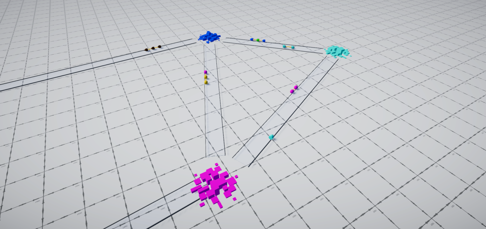
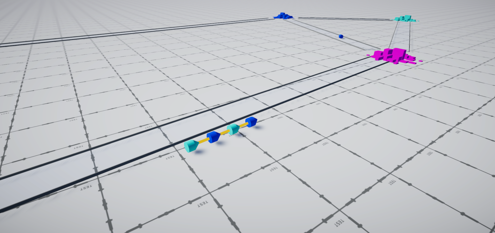
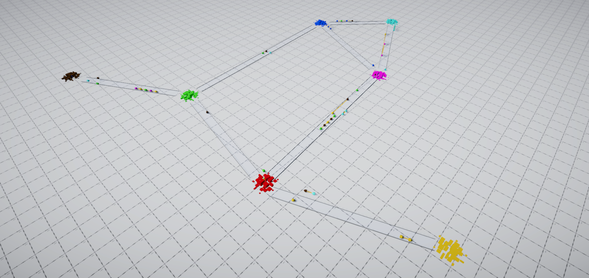
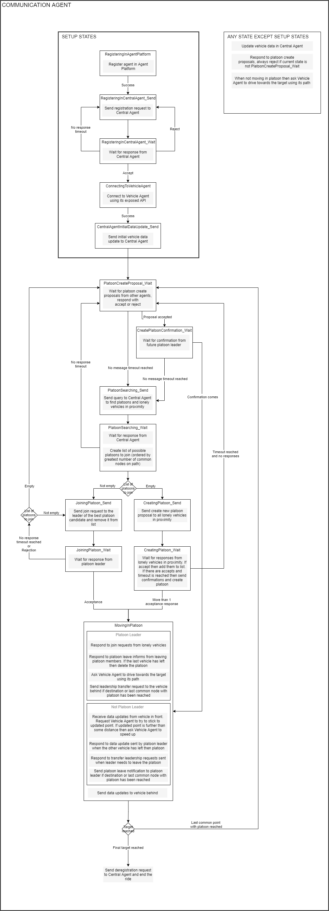

# Vehicle Platooning

Simulation of highway vehicle platooning using an agents system approach.  
It is a part of the research paper [link](https://ieeexplore.ieee.org/document/9567855)  
Vehicle platooning is a method for driving a group of vehicles together in a platoon to reduce fuel consumption and increase the capacity of highway roads.

### Agents
- Vehicle Agent - Responsible for driving the vehicle. Controls the speed and direction of moving. It is working in each of the vehicles. (Just like an autonomous vehicle system) 
- Communication Agent - Responsible for communication with Vehicle Agent its Vehicle Agent, Central Agent and other Communication Agents in proximity. It is working in each of the vehicles (but Vehicle Agents can drive without it enabled)
- Central Agent - Responsible for storing information (location, destination, route, platoon information) about all vehicles registered in the system. 

### Brief description of the way of work
From a technical point of view, this simulation uses an agent system with a FIPA-like communication protocol.

- Vehicles are being spawned in the cities (nodes) and calculate the shortest way (via other cities) to their destination using the Djikstra pathfinding algorithm.
- Each city is marked with a different color. Vehicle color indicates the destination city they are driving to.
- The communication Agent in each vehicle (if enabled) registers itself in the Central Agents and connects to its Vehicle Agent.
- Communication Agent alternately tries to join a platoon in its proximity or creates a new one if no other platoon is present or its join request has been rejected. To do this it queries Central Agent for other Communication Agent in proximity. 
- Communication Agent sends joining request only to a platoon which is certain radius and travels via at least one common city with the Communication Agent.
- When reaching the last common city, the Communication Agents leaves the platoon and follows its path to its destination, and again try to find a platoon that is going the same way.
- When moving in platoon vehicle in front sends updates about its position to the vehicle behind.
- If the platoon leader is leaving the platoon (because it has reached its destination) then hands the leadership to the vehicle behind.

For a more detailed approach please see the Communication Agent state machine diagram below. 
All communication between agents is done using asynchronous messaging, except "Communication Agent - Vehicle Agent" communication which for simplicity uses on-board local computer API communication.

### How to use it
##### Approach 1
Download built version from releases page, unpack it, and run Vehicle-Platooning.exe
Built version offers:
- Camera movement (WASD and RMB)
- Spawning vehicles in the cities by clicking near them with LMB (they will move to the randomly selected city)
- Constantly spawning vehicles in randomly selected cities (they will move to the randomly selected city)
- Running predefined deterministic scenarios:
- Scenario 1  
  3 agents start in red city, form a platoon, and move to cyan city.
  3 agents start in yellow city, form a platoon, move to the last common point which is magenta city, two of them go to blue city and one of them move cyan city.
  1 agent starts in green city move to red city where it joins platoon and move with it to magenta city and ends there.

- Scenario 2  
  Same as scenario 1 but with the platooning system disabled

Fuel consumed by all vehicles is displayed on the user interface. 
By running these two scenarios we can simulate the total fuel usage and see how big the increase in fuel efficiency thanks to implemented platooning system. 

##### Approach 2
Download all Unity project files from this repository and run the project in Unity Editor (version 2020.3.4f1)
This version offers everything that the built version offers and a possibility to change the parameters of the pre-configured Vehicle Agent and Communication Agent (available in prefab object of the Vehicle)

The most important parameters of Communication Agent:
- platoonJoinRadius - Radius of detecting other platoons in proximity
- platoonSpeed - Speed of driving in platoon
- waitForPlatoonSpeed - Speed of vehicle when it needs to wait to be overtaken by the platoon it joined
- catchUpPlatoonSpeed - Speed of vehicle when it is further than catchUpPlatoonDistance from the vehicle it is following if the distance is smaller then platoon speed is used
- catchUpPlatoonDistance - Distance to the vehicle that should be followed above which vehicle drives with catchUpPlatoonSpeed
- betweenVehicleDistances - Distance from the vehicle in the direction opposite to its driving direction (it should be similar to catchUpPlatoonDistance)
- maxPlatoonSize - Maximal number of vehicle in the platoon

### Screenshots

  

  

  

### Communication Agent state machine

  

